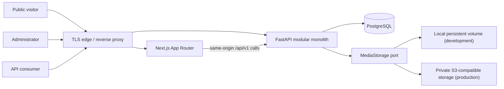

# R1 System Architecture

## Purpose and status

This document is the architectural baseline for R1. It resolves the working assumptions in `docs/requirements/assumptions-and-scope.md` and is subordinate only to `SPEC.md` and the stable requirements in `product-requirements.md`. It covers F1/F2 and the documented AI extension boundary; it does not authorize F3/F4 behavior (`AI-001`–`AI-004`).

## Architectural principles

1. **Modular monolith, one backend deployable.** FastAPI modules own business capabilities and expose them through application services (`NFR-007`, ADR-0001).
2. **API-first.** Browser and external clients use `/api/v1/`; Next.js may call it server-side, but never PostgreSQL (`API-001`, `NFR-008`).
3. **Dependency direction is inward.** Transport and infrastructure depend on application/domain contracts. Domain code does not import FastAPI, SQLAlchemy, storage SDKs, or framework request objects.
4. **Private unless deliberately published.** Public queries use dedicated publication-safe services and schemas. Admin schemas are never reused as public response schemas (`F1-007`, `SEC-004`).
5. **Transactional consistency first.** An application command, its aggregate changes, and its audit entry commit in one PostgreSQL transaction where feasible.
6. **No optional infrastructure without an active need.** R1 has no mandatory Redis, broker, scheduler, vector database, or AI SDK (`NFR-017`, ADR-0009).
7. **Contracts are explicit.** Pydantic request/response types, allow-listed filters, stable errors, and discriminated block schemas are part of the OpenAPI contract.

## Runtime context



The edge exposes the public/admin Next.js application and routes `/api/*` to FastAPI under one origin. External API consumers call FastAPI through the same edge. PostgreSQL and object storage are private-network dependencies. No frontend process receives database credentials.

## Backend structure and dependency rules

```text
backend/app/
  api/v1/                 # routers, dependencies, request/response mapping
  modules/
    identity/             # administrator, password, session, bootstrap
    api_access/           # API tokens, scopes, bearer authentication
    profile/              # public/private profile fields
    settings/             # public site configuration
    navigation/           # navigation and footer trees
    skills/
    experiences/
    projects/
    blog/
    pages/                # pages, page revisions, typed blocks
    media/
    contacts/
    audit/
    health/
  common/
    domain/               # IDs, time, domain errors, events
    application/          # transaction, pagination, actor/request context ports
    security/             # authorization policies, redaction contracts
  infrastructure/
    database/             # SQLAlchemy session, repositories, migrations support
    storage/              # local and S3 MediaStorage adapters
    observability/        # JSON logging, metrics, request IDs
    rate_limit/           # PostgreSQL-backed R1 policy adapter
  ai/                     # interfaces/documentation boundary only in R1
```

Each business module contains `domain`, `application`, and `persistence` packages as warranted; small modules need not create empty folders. Allowed dependencies are:

- `api -> application -> domain`;
- `persistence/infrastructure -> application ports + domain`;
- one module may call another module's **application facade**, never its repository or ORM model;
- cross-module writes are coordinated by one application service and one unit of work;
- route handlers validate transport concerns, construct an actor context, call one use case, and map its result/error.

### Module ownership

| Module           | Owns                                                       | May expose to peers                 |
| ---------------- | ---------------------------------------------------------- | ----------------------------------- |
| identity         | administrators, password hashes, sessions, bootstrap state | current actor, session invalidation |
| api_access       | token records, token scopes, token authentication          | scoped API actor                    |
| profile/settings | profile and site configuration                             | public projections, admin commands  |
| navigation       | navigation/footer nodes                                    | published navigation projection     |
| skills           | skills and categories                                      | visible skill references            |
| experiences      | experience aggregate/revisions/relations                   | published experience projection     |
| projects         | project aggregate/revisions/relations                      | published project projection        |
| blog             | post aggregate/revisions/taxonomy                          | published post projection           |
| pages            | page aggregate/revisions/blocks/block references           | published page projection           |
| media            | metadata, object key, usage query, storage port            | media descriptor/delivery URL       |
| contacts         | private submissions and lifecycle                          | admin-only commands/queries         |
| audit            | append-only audit entries                                  | safe admin query                    |
| health           | dependency probes/build metadata                           | safe status only                    |

Direct cross-module foreign keys are allowed in the database for integrity, but ORM relationships must not become an alternate business API. Cross-module deletion is `RESTRICT` by default.

## Frontend structure

```text
frontend/
  app/
    (public)/             # Server Components by default
    admin/                # authenticated dashboard; client islands for forms/editor
    api/                  # only narrowly justified Next.js route handlers/BFF helpers
  features/               # vertical UI capabilities and generated-client wrappers
  components/{public,admin,blocks,ui}/
  lib/{api,auth,schemas,observability}/
  tests/ and stories/
```

Public pages use Server Components for initial reads and metadata. Interactive filtering, theme controls, editors, and forms are client components. A generated TypeScript client is produced from the checked OpenAPI artifact and wrapped by feature-level functions; handwritten calls are limited to uploads/streaming where generator support is inadequate (ADR-0010). Browser admin calls are same-origin and send the session cookie plus CSRF header on unsafe methods.

## Command/query and transaction model

- Application commands accept explicit DTOs and an `ActorContext`; they never accept arbitrary dictionaries for persistence.
- A request-scoped SQLAlchemy 2 async session implements the unit of work. Application services decide commit/rollback; repositories do not commit.
- Domain invariants run before persistence, while unique/check/foreign-key constraints provide the final concurrency guard.
- Query services return purpose-built projections and select-loading plans to avoid N+1 access (`NFR-006`).
- Optimistic concurrency uses an integer `version`/ETag on administrator-edited aggregates. Mutations require `If-Match`; stale writes return `409 RESOURCE_VERSION_CONFLICT`.
- Audit recording participates in the transaction for security and content mutations. Failed authentication audits use a separate short transaction because no business transaction commits.

## Publication and preview

Pages, experiences, projects, and posts use immutable revisions. The aggregate points to a mutable draft revision and, independently, an immutable published revision. Publishing freezes the draft, assigns it as the published revision, and creates a copy-on-write draft for subsequent edits. Unpublishing clears public eligibility without deleting revisions. Public eligibility is:

```text
published_revision_id is not null
AND visible = true
AND publish_at <= database UTC now()
AND deleted_at is null
```

`featured` never bypasses these gates. Scheduling is query-driven in R1: a future `publish_at` becomes effective without a worker (`F1-011`, ASM-007, ADR-0007). Preview is available only to a valid admin session through a separate preview endpoint, returns `Cache-Control: private, no-store`, and is excluded from sitemap/metadata discovery.

Skills, profile, settings, and navigation are immediately effective after validated admin save; their visibility/public-field rules still apply. This distinction is explicit in their contracts.

## Typed page blocks

`PageBlock` has relational common fields and `config JSONB` containing only type-specific data. `block_type` and `schema_version` select a backend Pydantic discriminated-union schema and the equivalent generated frontend type. Content references are extracted into `page_block_reference` rows so referential integrity, public filtering, and media usage are queryable. Unknown fields/types/versions are rejected. Published revision data is immutable; schema migrations are explicit adapters and data migrations, never silent runtime mutation (ADR-0004).

## Media

The media module owns a `MediaStorage` port (`put`, `open`, `delete`, `exists`, `signed_delivery_url`) and validates decoded image bytes before storage. Object keys are generated UUID-based keys and preserve no user path. Storage objects are private by default. The public delivery endpoint serves or redirects only media referenced by currently public content; admin delivery requires a session. Local storage is for development/single-host deployments; S3-compatible private storage is the production recommendation (ADR-0006).

## Background and scheduling boundary

R1 synchronous requests perform bounded work only. Scheduled publication is time-gated querying. Retention cleanup, orphan checks, and backups are explicit idempotent operator commands and can be run by a platform cron without embedding a scheduler. If a future active requirement needs retries or long-running work, a worker adapter will invoke the same application commands with idempotency keys; Redis/broker selection then requires a new ADR. Web routes never call worker implementations directly (ADR-0009).

## Observability and audit

- The edge accepts or creates an unguessable request ID; FastAPI validates its syntax or replaces it and returns it in `X-Request-ID` and errors.
- Structured logs contain event name, level, UTC time, request ID, route template, status, duration, and safe actor/resource IDs. Bodies, cookies, authorization headers, token secrets, contact content, and password fields are redacted (`SEC-009`).
- Audit is an application security record, not a debug log. Entries are append-only, use a controlled event catalog, and store allow-listed JSON metadata. Raw IP addresses are not stored in audit; a rotating-key HMAC pseudonym may support abuse investigation according to policy (ADR-0008).
- Metrics include request rates/latency/status, DB pool health, auth/rate-limit outcomes, storage errors, and publication counts without high-cardinality personal data.

## Deployment topology

The supported baseline is separate production containers for Next.js and FastAPI behind a TLS-terminating reverse proxy/load balancer, one PostgreSQL service, and private S3-compatible object storage. Schema migration runs once as a release job before application rollout; application replicas never auto-migrate at startup. Readiness gates traffic on PostgreSQL connectivity and migration compatibility. Liveness checks process responsiveness only (`API-007`).

Configuration is environment/secret-store driven and validated at startup. Secrets include database credentials, cookie/CSRF signing keys, token-digest pepper, HMAC privacy keys, and storage credentials. Public analytics identifiers are ordinary settings; analytics secrets are not (`F2-015`). Containers run non-root, use read-only filesystems except explicit temp/media mounts, and emit logs to stdout. Backups cover PostgreSQL plus object storage and are restore-tested.

Redis is absent from the baseline. PostgreSQL-backed security counters plus edge throttling meet R1's low-volume needs. A multi-replica/high-volume deployment may add Redis through the rate-limit port after an ADR and failure-mode review.

## Resolved assumptions and remaining owner decisions

| Item        | R1 decision                                                                                                                  |
| ----------- | ---------------------------------------------------------------------------------------------------------------------------- |
| ASM-001     | One administrator privilege level; schema keeps stable user IDs but no unused RBAC engine.                                   |
| ASM-002/003 | Opaque cookie sessions for browser admin; scoped bearer tokens for integrations; unauthenticated public read models only.    |
| ASM-004     | Page/page-size pagination, default 20, maximum 100.                                                                          |
| ASM-005     | Controlled CommonMark Markdown, raw HTML disabled, sanitized output.                                                         |
| ASM-006     | Local development adapter; private S3-compatible production adapter recommended.                                             |
| ASM-007     | Future-dated publication is database-time gated; no R1 scheduler.                                                            |
| ASM-008     | Archive is normal; explicit hard delete is allowed and audited. Default retention is 365 days; purge is an operator command. |
| ASM-009     | Only public analytics identifiers/placeholders are settings; secrets remain deployment secrets.                              |
| ASM-010     | Audit is append-only to applications; default retention 400 days, operator purge only.                                       |
| ASM-011/012 | English R1 UI; locale/timezone affect formatting. Health output is a status enum plus safe build info.                       |
| ASM-013     | Security policy defaults are fixed in `security-architecture.md` and configurable within safe operator bounds.               |
| ASM-014     | License selection remains a maintainer/legal decision; it does not change runtime architecture.                              |
| ASM-015     | Owner supplies reviewed legal/privacy text.                                                                                  |

Remaining release risks requiring non-architectural owner/operator confirmation are
jurisdiction-appropriate legal/privacy content, whether a 365-day contact and 400-day audit
retention policy fits the deployment's law/contracts, S3 provider/region, backup targets, and final
production hostname/trusted origins. These must be resolved before release but do not justify
insecure fallback behavior. The maintainer selected the MIT License for the repository.
