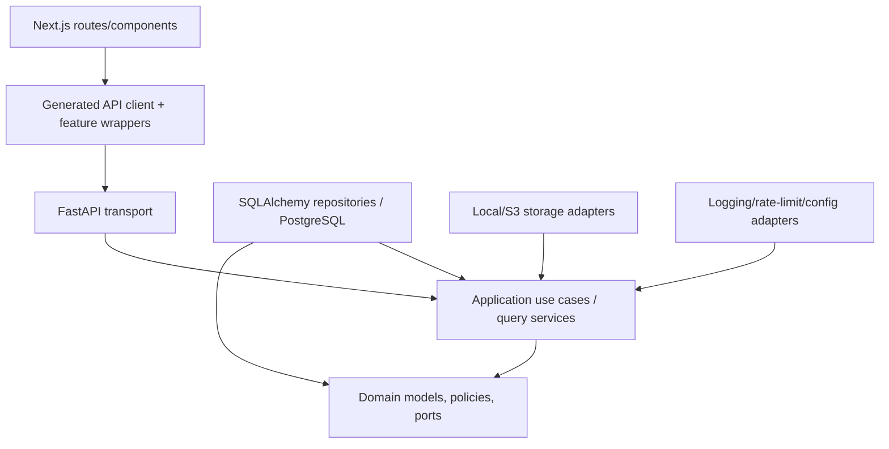

# Dependency Map

## Code dependency direction

Domain and application packages do not import FastAPI, SQLAlchemy ORM classes, Next.js, object-storage SDKs, or concrete rate-limit implementations. Adapters implement inward-facing ports. A module calls another module only through its application facade.

## Module relationships

| Consumer | Provider | Contract and reason |
|---|---|---|
| pages/blocks | profile, skills, experiences, projects, blog, media | Validate/resolve typed content references |
| projects | skills, experiences, media | Revision-scoped editorial relations |
| experiences | skills, projects | Revision-scoped editorial relations |
| blog | media | Cover/inline asset validation |
| profile/settings/navigation | media | Branding/profile/link assets |
| media | all content modules | Read-only active-usage query before delete; no table reach-through |
| audit | all application modules | Receive controlled audit facts/actor context |
| public queries | content modules | Publication-safe projections only |
| future AI boundary | public content facade | Published document snapshots only |

Cycles are broken by application ports. In particular, content modules publish `MediaUsageChanged` facts or call a usage registry; media does not import their ORM models.

## Required runtime dependencies

| Dependency | Role | Failure behavior |
|---|---|---|
| PostgreSQL | transactions, content, sessions, limits, audit | readiness fails; liveness remains healthy; no writes accepted |
| Next.js | public/admin rendering | edge returns frontend unavailable; API may remain operational |
| FastAPI | business/API boundary | frontend data operations fail with designed states |
| configured media store | image objects | content without media may render; upload/delivery fails safely and is observable |

Redis, a broker/worker, vector DB, LLM SDK, and cloud-specific orchestrator are absent in R1 (`NFR-017`, `AI-004`). Local media is a configured adapter, not a portable multi-replica production guarantee.

## Build-time/tooling dependencies

Backend: Python 3.12+, FastAPI, Pydantic, SQLAlchemy 2, Alembic, PostgreSQL driver, Argon2id library, structured logging, Pytest/Ruff/Mypy. Frontend: Next.js App Router, React, strict TypeScript, Tailwind, accessible component primitives, React Hook Form, Zod, Playwright, Vitest, Testing Library, Storybook. The OpenAPI generator is pinned and its output is reproducible (`NFR-009`, `NFR-010`).

Optional packages require: a linked current requirement, alternatives analysis, owner/module, failure behavior, security/license review, locked version, test plan, and ADR if architecturally significant. SDK types remain inside adapters.

## Deployment dependencies

The edge depends on frontend/API health; FastAPI depends on PostgreSQL and configured storage; migrations depend on PostgreSQL and run once before rollout. Backup/restore spans PostgreSQL plus media objects. Secrets come from a deployment secret manager/environment injection and never from website settings or source.
