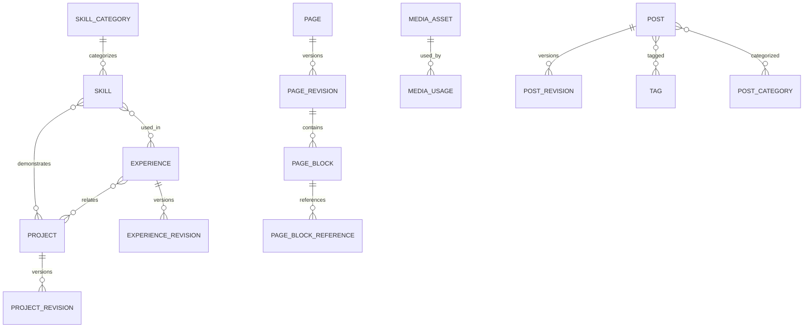
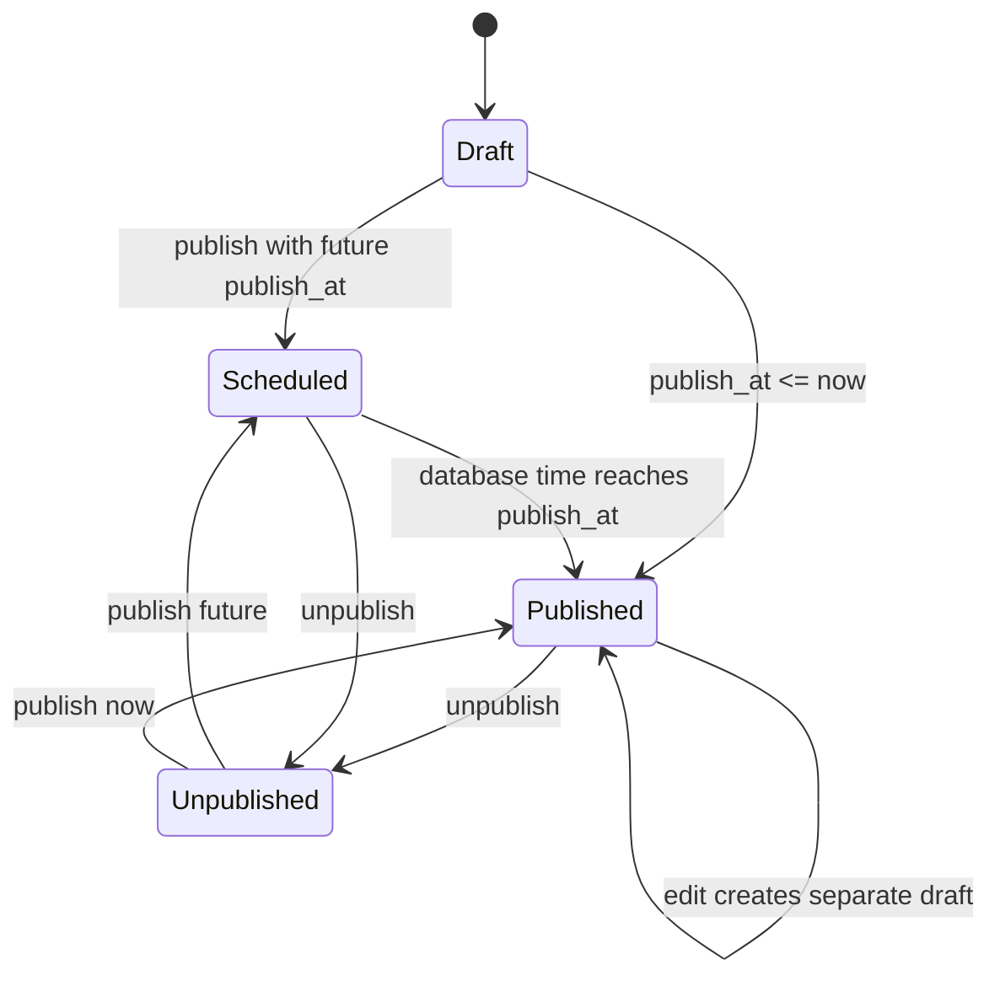

# Domain Model

## Conventions

Entities use opaque UUIDv7 identifiers, UTC timestamps, and integer optimistic versions. `created_at`/`updated_at` describe records; publication time is separate. Domain services receive a `Clock` so rules are deterministic in tests. Soft deletion is used only where restoration or stable references are valuable; contact hard deletion and unreferenced media deletion are explicit destructive operations.

## Bounded modules and aggregates

| Module | Aggregate root / entity | Principal rules |
|---|---|---|
| Identity | `Administrator`, `AdminSession` | One R1 privilege level; initial password blocks ordinary commands; password change revokes sessions. |
| API access | `ApiToken` | Secret shown once; digest only; explicit scopes; expiry/revocation/rotation deny old secrets. |
| Profile | `Profile` | Public projection allow-lists administrator-approved fields; private fields never appear by omission logic alone. |
| Settings | `WebsiteSettings` | Singleton; public and private configuration are separate schemas; deployment secrets are not fields. |
| Navigation | `NavigationMenu`, `NavigationItem`; `Footer`, `FooterItem` | Bounded depth (2), sibling order unique, internal destinations valid, URL schemes allow-listed. |
| Skills | `SkillCategory`, `Skill` | Unique normalized slug; score 0–100; nonnegative experience years; featured cannot override visibility. |
| Experiences | `Experience`, `ExperienceRevision` | Date invariant; publication revision; related skills/projects validated. |
| Projects | `Project`, `ProjectRevision` | Unique slug; publication revision; media and related entities validated; related project cannot self-reference. |
| Blog | `Post`, `PostRevision`, `Tag`, `PostCategory` | Unique slug; controlled Markdown; publication time; reading time derived; related post cannot self-reference. |
| Pages | `Page`, `PageRevision`, `PageBlock`, `PageBlockReference` | Unique nonreserved slug; immutable published revision; typed/versioned block config; deterministic order. |
| Media | `MediaAsset`, `MediaUsage` | Decoded-image validation; generated key; in-use deletion protection. |
| Contacts | `ContactSubmission` | Private always; consent evidence; lifecycle transition; no message in logs/audit. |
| Audit | `AuditEntry` | Append-only controlled event; safe metadata only; no update/delete through API. |

## Content relationships

Relationships that are editorial content (for example skills on a project) are attached to the relevant revision so draft edits cannot leak into the published view. The stable aggregate stores identity, slug, visibility, ordering, and revision pointers. This gives public queries one internally consistent revision.

## Publication lifecycle

`Scheduled` is a derived display state, not a background transition. Publishing validates all referenced content and required metadata atomically. A referenced item need not itself be public to save a draft, but publication rejects required references that would be unusable publicly, and render-time public services filter optional referenced content defensively. Preview reads the draft revision through an administrator-only query.

## Page and block model

`Page` owns route identity and lifecycle pointers. `PageRevision` owns title, description, SEO fields, and ordered `PageBlock` children. Blocks have:

- common relational fields: ID, type, schema version, order, visible, theme/layout variants, responsive settings;
- type-specific `config` validated by the block registry;
- normalized `PageBlockReference` rows for `media`, `skill`, `experience`, `project`, `post`, and internal page targets;
- no executable code, arbitrary HTML, arbitrary CSS, or arbitrary database query.

Initial block kinds are `hero`, `profile_summary`, `call_to_action`, `statistics`, `skills_grid`, `featured_skills`, `experience_summary`, `experience_list`, `project_grid`, `featured_projects`, `latest_posts`, `rich_text`, `image`, `image_with_text`, `links_collection`, `contact_callout`, `testimonial`, `divider`, and `spacer` (`F1-005`). A registry entry defines its current schema, allowed schema migrations, renderer key, reference extraction, and public-data resolver.

Block order uses integer positions scoped to a revision. Bulk reorder accepts the complete ordered ID list and rewrites positions in one transaction, protected by the page version. Sparse/fractional ordering is deliberately avoided because page sizes are small and deterministic behavior matters more.

## Important invariants

### Slugs and routes

Slugs are Unicode-normalized to ASCII lowercase kebab case, 1–80 characters, and match `^[a-z0-9]+(?:-[a-z0-9]+)*$`. R1 custom pages are a single path segment. Case-insensitive unique indexes enforce collisions. Reserved first-segment values are:

`admin`, `api`, `_next`, `about`, `experience`, `experiences`, `skills`, `projects`, `blog`, `contact`, `privacy`, `legal`, `robots.txt`, `sitemap.xml`, `favicon.ico`, `assets`, `media`, `health`, `docs`, `openapi.json`.

The registry is a shared backend constant tested against Next.js routes; adding a platform route updates the registry before deployment (`F2-013`).

### Experiences

- `current_position=true` requires `end_date=null`.
- `current_position=false` permits an unknown end date, but if present it must be on/after `start_date`.
- `remote_status` is one of `onsite`, `hybrid`, `remote`.
- start date is required; calendar dates are used rather than timestamps.

### Links

Internal links are canonical root-relative paths resolved against registered or published destinations. General external links allow `https` only. Explicit contact fields may additionally allow normalized `mailto` and `tel`. `javascript`, `data`, protocol-relative URLs, credentials in URLs, and control characters are rejected. New-window external links render with `noopener noreferrer`.

### Contacts

States are `unread -> read -> archived`, with `archived -> read` restore allowed. Hard deletion is allowed from any state only after explicit confirmation and creates an audit event containing the submission ID and state, never body/email. Consent timestamp, policy version, and source form are retained. Default retention is 365 days from submission; an idempotent operator purge command deletes expired entries. No unauthenticated query service exists.

### Media

Accepted R1 formats are JPEG, PNG, WebP, and GIF only if animation policy is explicitly enabled (disabled by default). SVG is excluded from upload because active content makes safe handling costly. Default maximum is 10 MiB and 36 megapixels with each dimension at most 6000 px. Decoder-detected MIME must agree with the allowed format. Metadata stripping and derivative generation may occur, but original bytes remain private. `MediaUsage` includes only active draft, current published, settings/profile, navigation/footer, and direct entity references; deleting a referenced asset returns a conflict with safe usage locations.

## Domain events

Domain events are immutable in-process facts emitted by application services after invariant validation, for example:

- `ContentPublished`, `ContentUnpublished`, `ContentDeleted`;
- `PublicProfileChanged`, `SkillVisibilityChanged`;
- `MediaStored`, `MediaDeleted`;
- `ContactSubmitted`, `ContactArchived`, `ContactDeleted`;
- `AdminLoginSucceeded`, `AdminLoginFailed`, `PasswordChanged`;
- `ApiTokenCreated`, `ApiTokenRotated`, `ApiTokenRevoked`.

R1 handlers create audit records and invalidate application caches, if any, inside the process. Events are not a public message contract and are not sent to a broker. Future durable consumers use the outbox design in `future-ai-extension-design.md`; they may not query module tables directly.

## Domain errors

Domain errors have stable codes independent of HTTP, such as `SLUG_RESERVED`, `EXPERIENCE_DATE_INVALID`, `PUBLICATION_REFERENCE_INVALID`, `MEDIA_IN_USE`, `TOKEN_SCOPE_REQUIRED`, and `RESOURCE_VERSION_CONFLICT`. The API maps them consistently; domain code never raises framework HTTP exceptions.
